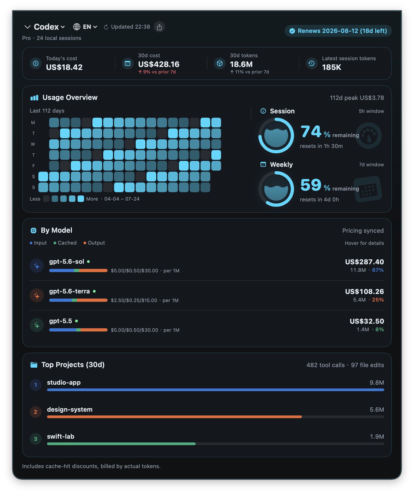
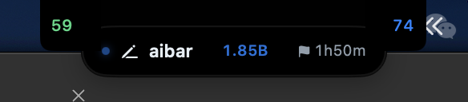
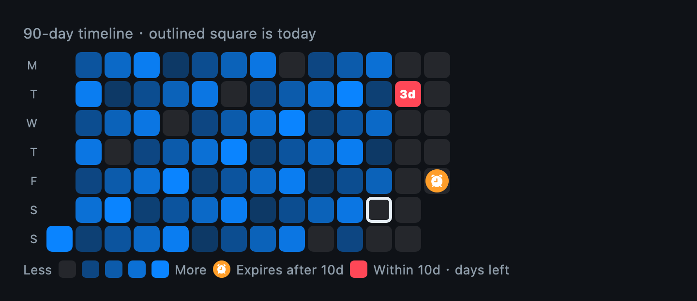

# aibar

<p align="right">
  <strong>English</strong> · <a href="./README.zh-CN.md">简体中文</a>
</p>

A local-first macOS dashboard for AI coding usage. aibar brings Codex session records, quota data, project and model statistics, and live activity into the space beneath your MacBook notch and the menu bar. It also provides an annotation tool designed for AI feedback on `fn + 4`—available when you need it and quiet when you do not.

> Version 0.1.12 · macOS 13 Ventura or later · Apple Silicon



## Features

- **Notch dashboard and menu-bar controls** — Hover over the notch or click the menu-bar trend icon to open the dashboard. Left-click toggles it; right-click exposes the activity capsule, screenshot command, update check, and quit action. aibar does not occupy the Dock.
- **Accurate usage totals** — Today and 30-day API-equivalent cost, 30-day tokens, latest-session tokens, and recent trends are calculated from the same locally scanned Codex sessions. Live quota refreshes at every wall-clock hour and again when Codex project activity changes, with both paths active in parallel.
- **Usage overview** — A 154-day token-intensity heatmap includes the exact daily total on hover, a compact 30-day daily token average, reset-credit expiry markers, and session (5h) and weekly (7d) quota meters.
- **Model and project breakdowns** — Model pricing, cost, token share, input/cached/output rates, and project totals are recomputed from the loaded sessions. Pricing is refreshed from the public source and falls back to a local cache when necessary.
- **Top projects** — Local projects are ranked by tokens and expand to show their model shares, tool-call totals, and file-edit totals.
- **Live activity capsule** — The capsule shows each Codex conversation's project, model, current phase, context tokens, and elapsed time. A continuously running conversation keeps its total elapsed time; screen/desktop tool calls use a distinctive window-plus-cursor marker and violet highlight instead of the generic tool state. Hover to expand simultaneous conversations and click one to return to it in Codex.
- **Screenshots made for AI feedback** — Press `fn + 4`, select a region, and annotate it with rectangles, arrows, ovals, freehand marks, or text-to-arrow callouts. Marks are automatically numbered and renumbered after deletion. Selection, deletion, undo, color choice, copy, and save are built in.
- **Subscription badge** — Renewal date and days left are read from the ChatGPT subscription information in local Codex credentials.
- **Bilingual UI and share cards** — The initial language follows macOS. Switch between English and 中文 from the dashboard header; the choice persists across launches. Share cards support multiple visual styles.
- **Safe automatic updates** — aibar checks GitHub Releases at launch and every six hours. Downloads are SHA-256 verified, and automatic replacement requires the same bundle ID and Developer ID signing identity.
- **Local first** — Session and activity data are read and aggregated on your Mac. aibar does not upload prompts, responses, or file contents. Displayed costs are API-equivalent estimates, not invoices.

## Notch controls and activity capsule



The two compact wings sit directly beside the physical notch: the left number is the weekly quota remaining, and the right number is the 5-hour session quota remaining. The capsule appears below the notch while Codex is working and shows live status, project, session tokens, and elapsed time. A flag distinguishes a continuously running Goal from an ordinary turn. Hovering either quota wing temporarily expands the activity view; clicking the capsule returns to that Codex conversation.

## Usage heatmap



The heatmap is a 90-day timeline laid out as complete Monday–Sunday weeks. Its continuous navy-to-sky-blue scale represents **daily token volume**, and a white outline marks today. Hover a cell to see its exact date, token total, and API-equivalent cost.

- **1B+ tokens** — a cyan dot appears inside the cell.
- **5B+ tokens** — the dot becomes a sparkle.
- **Reset in more than 10 days** — an orange alarm marks the exact expiry date.
- **Reset within 10 days** — the cell turns red and shows the remaining days, such as `3d`.

The timeline extends to the furthest known reset expiry while keeping a fixed 90-day window. Milestone rewards stay inside their cells, avoiding noisy outlines across consecutive high-usage days.

## Install

### Homebrew (recommended)

```bash
brew tap zszbyzsz/aibar https://github.com/zszbyzsz/aibar.git
brew install --cask aibar
```

If Homebrew reports unrelated casks such as `gcloud-cli` or `libreoffice` as unreadable, the Homebrew program and Cask API metadata are usually out of sync; those casks are not aibar dependencies. Restore Homebrew's official upstream and repair the affected casks before retrying:

```bash
git -C "$(brew --repository)" remote set-url origin https://github.com/Homebrew/brew
brew update-reset "$(brew --repository)"
brew update
brew reinstall --cask gcloud-cli libreoffice
brew install --cask aibar
```

Use `brew config` to verify the `ORIGIN` and Homebrew version. If you intentionally use a third-party mirror, ensure it provides a complete Homebrew version compatible with the current Cask API. `brew update-reset` discards local committed and uncommitted changes in the Homebrew repository, so preserve intentional changes first.

To update:

```bash
brew update
brew upgrade --cask aibar
```

Packages through `v0.1.12` are ad-hoc signed, so each version has a different macOS privacy identity. After upgrading, grant Screen Recording again if prompted. Moving to the first Developer ID signed release will require one final reauthorization; later releases signed by the same identity will retain that permission.

### Download the app

Download [`aibar-0.1.12.zip`](https://github.com/zszbyzsz/aibar/releases/download/v0.1.12/aibar-0.1.12.zip), unzip it, drag `aibar.app` to Applications, and open it.

Use a release signed consistently with the same Developer ID to preserve Screen Recording consent through automatic updates. If macOS blocks the first launch, Control-click the app in Finder and choose **Open**. If it remains quarantined:

```bash
xattr -dr com.apple.quarantine /Applications/aibar.app
```

### Build from source and launch at login

```bash
git clone https://github.com/zszbyzsz/aibar.git
cd aibar/aibar
./scripts/install.sh
```

The script builds the release app, installs it at `~/Applications/aibar.app`, and registers a per-user LaunchAgent. To uninstall:

```bash
cd aibar/aibar
./scripts/uninstall.sh
```

## Usage

1. Launch aibar. It runs around the menu bar and notch without occupying the Dock.
2. Hover over the notch or click the menu-bar icon to inspect the dashboard. Right-click the icon for activity, screenshot, update, and quit commands.
3. Choose a language in the dashboard header or use the share button to create a usage card.
4. Press `fn + 4`, select a region, add numbered annotations, then copy or save the result.

## Data and privacy

- aibar reads local sessions and activity metadata from `~/.codex` by default; set `CODEX_HOME` to use another local directory.
- The activity monitor reads only the metadata it needs, never conversation titles or message previews.
- Local caches and screenshot work stay on your Mac. Temporary screenshot source files are removed when capture processing ends.
- Update checks request only public GitHub release metadata and never include session or project data. Digest-verified archives remain in the local cache.
- Claude Code and Trae CN scanners are included in the codebase, while the current dashboard experience focuses on Codex.

## Build and test

```bash
cd aibar
swift build
swift test
./scripts/build-app.sh
open dist/aibar.app
```

`build-app.sh` creates an ad-hoc signed app for local development by default, so macOS may request privacy access again after rebuilding. Production packages must use the release script, which rejects ad-hoc signatures and identities tied to a per-build CDHash:

```bash
SIGNING_IDENTITY="Developer ID Application: Your Name (TEAMID)" \
  ./scripts/package-release.sh 0.1.12
```

An Ad-hoc package can be produced only through an explicit opt-in when privacy reauthorization is acceptable:

```bash
ALLOW_ADHOC_RELEASE=1 ./scripts/package-release.sh 0.1.12
```

## License

[MIT](LICENSE)
