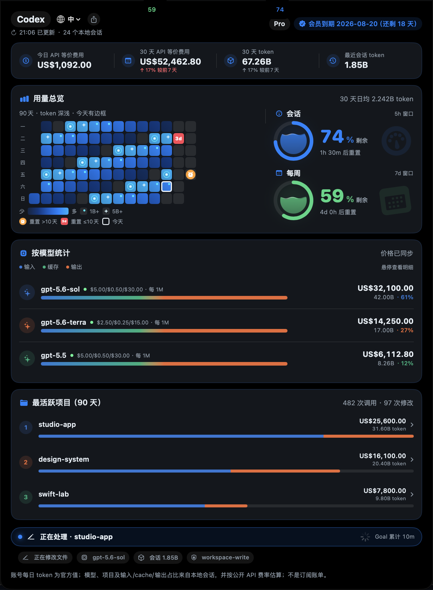
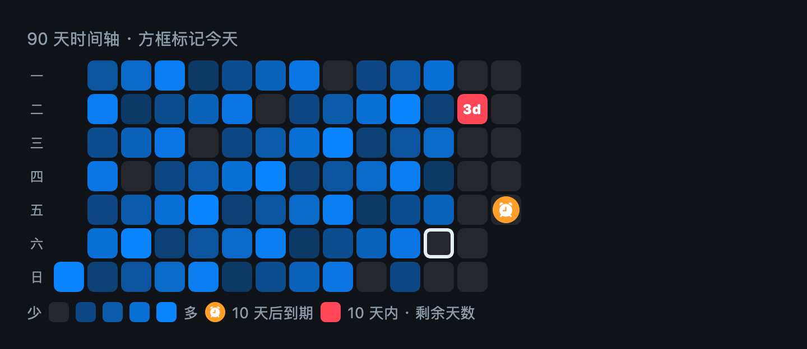

# aibar

<p align="right">
  <a href="./README.md">English</a> · <strong>简体中文</strong>
</p>

aibar 是一款本地优先的 macOS AI 编程用量仪表盘。它把 Codex 会话记录、配额、项目与模型统计和实时运行状态收进 MacBook 刘海下方与状态栏，并通过 `fn + 4` 提供为 AI 反馈设计的截图标注工具——需要时展开，不需要时保持安静。

> 版本 0.1.11 · macOS 13 Ventura 或更高版本 · Apple Silicon



## 功能一览

- **刘海仪表盘与状态栏入口**：把指针移到 MacBook 刘海区域，或点击状态栏的趋势图标即可展开。左键显示／隐藏，右键可访问运行胶囊、截图、检查更新和退出。aibar 不占用 Dock。
- **准确的用量统计**：今日与 30 天 API 等价费用、30 天 token、最近会话 token 和近期趋势，统一基于本地扫描到的 Codex 会话计算；应用运行期间即使没有活跃会话，也会每小时主动同步一次在线额度。
- **用量总览**：154 天 token 强度热图支持悬停查看精确日总量，右侧显示紧凑的 30 天日均 token、reset 额度到期标记，以及会话（5 小时）与周（7 天）配额。
- **模型与项目明细**：模型价格、费用、token 占比、输入／缓存／输出单价和项目汇总，都会随当前读取的会话重新计算；定价优先从公开来源刷新，必要时使用本地缓存。
- **最活跃项目**：本地项目按 token 排序，展开后可查看模型占比、工具调用次数和文件修改次数。
- **运行状态胶囊**：显示每个 Codex 对话的项目、模型、当前阶段、上下文 token 和耗时。连续运行的对话保留完整累计时间；当 Codex 调用屏幕/桌面工具时，胶囊会用独特的“窗口 + 鼠标指针”标识和紫色高亮区分普通工具调用。悬停可展开多个并行对话，点击可回到对应的 Codex 对话。
- **为 AI 反馈优化的截图**：按 `fn + 4` 选择区域，可添加方框、箭头、圆形、自由画笔和“文字 → 箭头”标记。标记自动编号，删除后重新排序，并支持选择、删除、撤销、颜色切换、复制和保存。
- **订阅到期徽章**：从本地 Codex 凭据中的 ChatGPT 订阅信息读取续费日期与剩余天数。
- **中英文界面与分享卡片**：首次启动跟随 macOS 语言，可在仪表盘标题栏切换 English／中文，选择会保留到下次启动；分享卡片支持多种视觉样式。
- **安全自动更新**：启动时及之后每 6 小时检查 GitHub Releases。下载包会经过 SHA-256 校验，且只有 Bundle ID 与 Developer ID 签名身份一致时才会自动替换。
- **本地优先**：会话与活动数据只在 Mac 本机读取和聚合，aibar 不上传提示词、响应内容或文件内容。显示金额为 API 等价估算，并非账单。

## 刘海配额与运行胶囊


两个紧凑的数字翼贴在物理刘海左右：左侧显示每周剩余配额，右侧显示 5 小时会话剩余配额。Codex 工作时，运行胶囊会出现在刘海下方，实时显示状态、项目、会话 token 和耗时；旗帜用于区分连续运行的 Goal 与普通单轮对话。悬停任一配额翼会暂时展开活动视图，点击胶囊可回到对应的 Codex 对话。

## 用量热图



热图是一条按完整周一至周日排列的 90 天时间轴。连续的深海军蓝到天蓝色阶表示**每天的 token 用量**，白色边框标记今天。悬停任意格子，可查看准确日期、token 总量和 API 等价费用。

- **1B+ token**：格子内部出现青色圆点。
- **5B+ token**：圆点升级为星芒。
- **10 天以后重置**：橙色闹钟直接标在到期日期上。
- **10 天以内重置**：格子变为红色，并显示剩余天数，例如 `3d`。

时间轴会延伸到当前已知的最晚 reset 到期日，同时始终保持 90 天窗口。里程碑奖励统一放在格子内部，避免连续高用量日期出现密集外框。

## 安装

### Homebrew（推荐）

首次安装需要添加此项目作为 tap：

```bash
brew tap zszbyzsz/aibar https://github.com/zszbyzsz/aibar.git
brew install --cask aibar
```

若 Homebrew 同时报出其他 Cask（例如 `gcloud-cli` 或 `libreoffice`）不可读，通常是 Homebrew 程序与 Cask API 元数据版本不一致，并非 aibar 的依赖。请先把 Homebrew 的 `ORIGIN` 恢复为官方仓库并修复这些 Cask，再重试安装：

```bash
git -C "$(brew --repository)" remote set-url origin https://github.com/Homebrew/brew
brew update-reset "$(brew --repository)"
brew update
brew reinstall --cask gcloud-cli libreoffice
brew install --cask aibar
```

可用 `brew config` 确认 `ORIGIN` 与 Homebrew 版本。若你有意使用第三方镜像，请确保它同步的是完整且与当前 Cask API 兼容的 Homebrew 版本。`brew update-reset` 会重置 Homebrew 主仓库中的本地提交和未提交修改；若你维护过这些修改，请先备份。

更新：

```bash
brew update
brew upgrade --cask aibar
```

`v0.1.11` 及更早的安装包使用 Ad-hoc 签名，每个版本的 macOS 隐私身份都不同。升级后若系统提示，请重新授予屏幕录制权限。迁移到首个 Developer ID 签名版本时还需要最后重新授权一次；之后使用同一 Developer ID 发布的更新会继续复用该授权。

### 直接下载安装包

在 [Releases](https://github.com/zszbyzsz/aibar/releases) 下载 `aibar-0.1.11.zip`，解压后将 `aibar.app` 拖入“应用程序”文件夹并打开。

请使用同一 Developer ID 签名的正式发布版，以便自动更新后保持屏幕录制授权。若 macOS 阻止首次启动，请在 Finder 中按住 Control 点击应用并选择“打开”；若仍被隔离，可执行：

```bash
xattr -dr com.apple.quarantine /Applications/aibar.app
```

### 从源码安装并设为登录项

```bash
git clone https://github.com/zszbyzsz/aibar.git
cd aibar/aibar
./scripts/install.sh
```

脚本会构建 Release 应用、安装到 `~/Applications/aibar.app`，并创建当前用户的 LaunchAgent，使应用登录后自动运行。卸载：

```bash
cd aibar/aibar
./scripts/uninstall.sh
```

## 使用方法

1. 启动 aibar；它只在状态栏与刘海附近显示，不占用 Dock。
2. 悬停刘海或点击状态栏图标查看仪表盘；右键图标可访问运行胶囊、截图、更新和退出命令。
3. 在仪表盘标题栏选择语言，或点击分享按钮生成用量卡片。
4. 按 `fn + 4` 选择截图区域，添加按顺序编号的标记后复制或保存。

## 数据与隐私

- 默认读取 `~/.codex` 中的本地会话和活动索引；可以通过 `CODEX_HOME` 指向其他本地目录。
- 活动监视仅读取必要元数据，不读取会话标题或消息预览。
- 本地缓存与截图内容会留在 Mac 上。截图捕获的临时源文件会在处理结束时删除。
- 更新检测只请求 GitHub 的公开版本元数据，不携带会话或项目数据；通过摘要校验的更新包保存在本机缓存目录中。
- 代码中包含 Claude Code 和 Trae CN 扫描器；当前仪表盘体验默认聚焦 Codex。

## 本地构建与测试

```bash
cd aibar
swift build
swift test
./scripts/build-app.sh
open dist/aibar.app
```

`build-app.sh` 默认生成仅用于本地开发的 Ad-hoc 签名应用；重新构建后 macOS 可能要求重新授权。正式版本必须通过发布脚本生成，它会拒绝 Ad-hoc 签名以及绑定到单次构建 CDHash 的身份：

```bash
SIGNING_IDENTITY="Developer ID Application: Your Name (TEAMID)" \
  ./scripts/package-release.sh 0.1.11
```

若确认可以在升级后重新授权，可通过显式开关生成 Ad-hoc 安装包：

```bash
ALLOW_ADHOC_RELEASE=1 ./scripts/package-release.sh 0.1.11
```

## 许可证

[MIT](LICENSE)
